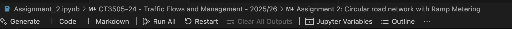

# CT3505-24 - Assignments 1 & 2 codebase installation instructions

## Installation steps
Note: these installation steps will be largely based on Visual Studio Code as your main interface. Other IDEs can be used, but the creation / activation of appropriate conda environments will have to be handled manually.

- Download and install [Visual Studio Code](https://code.visualstudio.com/)
- Download and install [miniconda](https://www.anaconda.com/docs/getting-started/miniconda/main) (recommended) or your preferred version of anaconda, to allow creating project-based environments
- Download and install [SUMO](https://eclipse.dev/sumo/)
- Launch Visual Studio Code
- In Visual Studio Code, select File -> Open folder.. and navigate to the folder containing this file.
- Open (any) one of the project's Jupyter notebooks (e.g. 'Assignment 1.ipynb')
- Click on "Select kernel..." on the top right of the Jupyter notebook screen, select "Python Environments..." and "Create new python environment". Create a ".conda" environment. Each time you open VSCode and this project, it will remember this is the right environment and always use it.
- Open VSCode's terminal (menu bar -> Terminal) *after* creating and selecting your .conda enviroment.
- Activate your new enviromnent by typing the following in the terminal window: conda activate .conda/
- Install *lxml* by typing the following in the terminal window: ```pip install lxml```
- Install *tud-sumo* by typing the following in the terminal window: ```pip install tud-sumo```
- Install *mercury* by typing the following in the terminal window: ```pip install mercury```

## Running steps
### Assignment 1:
- [ ] In the terminal window, type "mercury run". If everything went smoothly during installation, your browser will open with a new window. Have fun!
### Assignment 2:
- [ ] Open the Jupyter notebook in Visual Studio Code and run it as-is, clicking the "Run all" button at the top of the page: 


